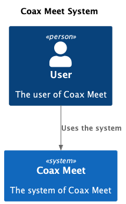
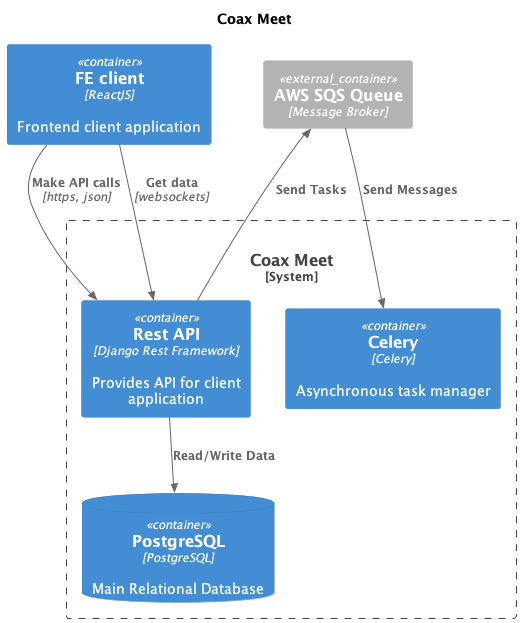

# About Project

Coax Meet - is a corporate video conferencing solution that allows users to interact with each other via group video calls.

Users are able to:

* Sign up with activation
* Restoring password
* Multi-language support
* Delete account
* Video conference
* Rooms creation
* Email reminders

## C4

Instead of describing the project, let's better look at the visual architecture of it.

## System level

* **User** - User of the system
* **Coax Meet** - Social network where users can interact with each other

## Containers level

* **AWS SQS**  - Message broker that provides asynchronous communication between services.
* **PostgreSQL** - Used for storing all data about users, their profiles, and messages backups.
* **FE** - Client application
* **Celery** - Processor that manages all background work, e.g. creating messages backups.
* **API** - Provides Coax Meet functionality via API. Used for data processing, communication between users, sending notifications etc.
